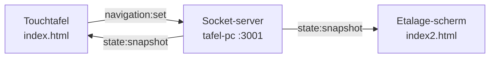

# iXperium Etalage

Interactieve tweeschermsopstelling voor **iXperium Smart Industry** (HAN).
Bezoekers verkennen op een touchtafel een ring van "planeten" — elke planeet is
een kennisroute. Tikken ze een onderwerp aan, dan verschijnt
de verdieping op een groot etalage-scherm ernaast.

De tafel is dus de bediening, het grote scherm de uitzending.

---

## De opstelling

| | Touchtafel | Etalage-scherm |
|---|---|---|
| Pagina | `index.html` | `index2.html` |
| React-app | `src/table/TableApp.tsx` | `src/kiosk/KioskApp.tsx` |
| Hardware | Intel NUC + touchscreen-tafel | Intel NUC + 75" scherm |
| Draait servers? | **Ja** (Vite :3000 + socket :3001) | Nee, laadt alles van de tafel-pc |
| Startscript | `scripts/nuc-start.sh` | `scripts/etalage-start.sh` |



Beide schermen zijn gewoon Chromium in kiosk-modus. Er is geen installatie,
geen database en geen cloud: alles draait lokaal op de tafel-pc.

---

## Snel aan de slag (lokaal)

Nodig: **Node 20 of nieuwer** (lokaal getest met 24) en npm.

```bash
npm install
npm run dev
```

`npm run dev` start twee processen tegelijk:

- **Vite** op poort 3000 — levert de pagina's uit (met hot reload)
- **socket-server** op poort 3001 — houdt de navigatiestatus bij

Open daarna twee tabs:

- Touchtafel: <http://localhost:3000/index.html>
- Etalage-scherm: <http://localhost:3000/index2.html>

Klik in de linker tab een route en een onderwerp aan; de rechter tab volgt
direct. Zo test je de hele flow op één machine.

Overige scripts:

| Commando | Doel |
|---|---|
| `npm run typecheck` | TypeScript controleren (geen output = goed) |
| `npm run build` | Productiebundel naar `dist/` |
| `npm run dev:frontend` | Alleen Vite |
| `npm run dev:server` | Alleen de socket-server |

> De NUC's draaien in de praktijk óók `npm run dev`, niet de build. Dat is
> bewust: geen extra buildstap bij een update, en hot reload werkt gewoon.

---

## Hoe het werkt

### 1. De schermen praten via één klein berichtje

Tik je op de tafel een onderwerp aan, dan stuurt die een bericht naar de
socket-server, ongeveer: *"niveau = detail, route = `rapid`, onderwerp =
`rapid-fablab`"*. De server bewaart die status en stuurt hem door naar alle
verbonden schermen.

Belangrijk om te weten bij storingen:

- De server houdt de status **in het geheugen**. Herstart je hem, dan staat
  alles weer op het beginscherm. Er gaat niets anders verloren.
- Elk bericht heeft een oplopend nummer (`seq`). Een bericht dat te laat
  aankomt wordt genegeerd, dus een oude status overschrijft nooit een nieuwe.
- Sluit het etalage-scherm later aan (of valt het weg), dan haalt het bij het
  verbinden meteen de actuele stand op. Het loopt dus nooit uit de pas.
- De verbinding herstelt zichzelf oneindig. De tafel herstarten betekent níet
  dat je het etalage-scherm ook moet herstarten.

Het etalage-scherm hoeft niets te weten van de tafel behalve het adres: het
laadt `http://<tafel>:3000/index2.html`, en de pagina bouwt zelf de websocket
naar poort 3001 van diezelfde host. Zie `src/shared/useNavigationSocket.ts`.

Relevante bestanden: `server/index.ts` (de server), `src/shared/protocol.ts`
(vorm van de berichten + validatie), `src/shared/navigation.ts` (status →
welke route/welk onderwerp).

### 2. Alle inhoud staat in één bestand

`src/shared/content.ts` bevat **5 kennisroutes** (AI, XR & HMI, Digital Twin,
Rapid Prototyping, Robotics) met daaronder in totaal 26 onderwerpen — precies
twee niveaus diep, niet dieper. Per onderwerp: titel, kleur, intro, detail,
highlights, toepassingen en een foto.

Beide schermen lezen uit dezelfde bron. Wil je tekst, kleur of een foto
wijzigen, dan is dit het enige bestand waar je hoeft te zijn.

### 3. De draaiende ring is één canvas-tekening

`src/app/components/OrbitRing.tsx` is het hart van de tafel. De planeten zijn
géén losse HTML-elementen: ze worden 60× per seconde op een `<canvas>`
getekend. Dat is een bewuste keuze — anders haalt de NUC het niet. Om dezelfde
reden worden planeetlichamen en tekstlabels één keer voorgetekend en daarna
alleen nog "gestempeld".

Aanklikken gebeurt met wiskunde: de app weet waar elke planeet staat en rekent
uit welke je raakt. Klik je in het rechter paneel op een onderwerp, dan draait
de ring die planeet eerst naar voren, houdt kort stil en selecteert hem dan —
alsof je er zelf op tikte.

### 4. De overgang tussen de schermen is een truc

Tik je een onderwerp aan, dan maakt de tafel een **foto (snapshot) van precies
die planeet** uit het canvas, laat hem van de tafel af vliegen, en stuurt dat
plaatje mee over de socket. Het etalage-scherm laat dezelfde bol van onderaf
opkomen. Zo lijkt het of de planeet van het ene scherm naar het andere reist.
(Daarom staat `maxHttpBufferSize` op 5 MB in `server/index.ts`.)

### 5. Twee dingen gebeuren automatisch

- **Inactiviteit**: na 5 minuten zonder aanraking gaat de tafel terug naar het
  startscherm, en via de socket ook het etalage-scherm. Elke aanraking zet die
  klok opnieuw. Zie `src/shared/useIdleTimeout.ts`; de tijd staat in
  `IDLE_RESET_MS` in `src/table/TableApp.tsx`.
- **Trage machines**: draait de app op Chromium onder Linux, dan schakelt hij
  zelf een aantal zware effecten uit (attribuut `data-render-profile`). Forceren
  om dit op je laptop te testen: `?renderProfile=chromium-linux` achter de URL.

---

## Waar staat wat

```
index.html  index2.html          de twee ingangen
server/index.ts                  socket-server: bewaart en verspreidt de status
src/
  table/TableApp.tsx             de touchtafel
  kiosk/KioskApp.tsx             het etalage-scherm
  shared/
    content.ts                   ALLE tekst, kleuren en foto's
    protocol.ts                  vorm van de berichten + validatie
    useNavigationSocket.ts       de websocket-verbinding
    navigation.ts                status -> route/onderwerp opzoeken
    useIdleTimeout.ts            de 5-minuten reset
    renderProfile.ts             zwakke-GPU detectie
  app/components/
    OrbitRing.tsx                de draaiende ring (canvas)
    KurzgesagtBackdrop.tsx       de ruimte-achtergrond (DOM/SVG/CSS)
    FlyingPlanet.tsx             de planeet die van de tafel af vliegt
  assets/topics/                 de topic-foto's
  styles/theme.css               huisstijl en alle animaties
scripts/                         opstartscripts voor de twee NUC's
docs/NUC-SETUP.md                GPU-problemen + etalage-pc installeren
```

---

## Veelvoorkomende aanpassingen

**Tekst of foto van een onderwerp wijzigen** — `src/shared/content.ts`. Een
nieuwe foto zet je in `src/assets/topics/`, importeer hem bovenaan het bestand
en verwijs ernaar via de `oldImages`-map. Niet via een URL of de map `zooi/`:
imports worden door Vite gebundeld en komen zo automatisch mee met een
`git pull` op beide NUC's.

**Inactiviteitstijd wijzigen** — `IDLE_RESET_MS` in `src/table/TableApp.tsx`.

**Snelheid/gedrag van de ring** — de constanten bovenaan
`src/app/components/OrbitRing.tsx` (`AUTO_ROTATE_SPEED`, `FRICTION`,
`AUTO_SELECT_*`).

**Adres van de socket-server overschrijven** — zet `VITE_SOCKET_URL` in een
`.env`-bestand. Normaal is dat niet nodig: het adres wordt afgeleid van de host
waarvan de pagina geladen is.

---

## In het iXperium: de twee pc's

Beide pc's draaien Ubuntu en starten hun eigen script automatisch op bij het
inloggen. Volledige instructies staan in **[docs/NUC-SETUP.md](docs/NUC-SETUP.md)**.

### Tafel-pc (`scripts/nuc-start.sh`)

Repo staat in `/home/kiosk/iXperium_Etalage`. Het script bepaalt dat pad zelf
(één map boven het script), dus de map mag hernoemd of verplaatst worden. Het
start `npm run dev`, wacht tot poort 3000 echt antwoordt (max 60s) en opent dan
Chromium in kiosk-modus op `localhost:3000`. Sluit Chromium af, dan ruimt het
op en begint opnieuw.

### Etalage-pc (`scripts/etalage-start.sh`)

Eén zelfstandig bestand; de repo hoeft daar niet te staan. Het zoekt de
tafel-pc zelf op het netwerk (laatst gebruikte adres → bekende hostnamen →
scan van het eigen subnet, gecontroleerd op de `<title>` van `index2.html`),
wacht tot die aan staat en opent dan `index2.html` in kiosk-modus. Herstart
Chromium automatisch als het afsluit.

### Belangrijk: GPU-versnelling

Zonder hardware-acceleratie rendert Chromium deze app op de CPU en zakt het
naar **6–10 fps** met knipperen bij kleurwissels. Daarom starten beide pc's
Chromium via `scripts/nuc-chromium.sh`, met vlaggen die het GPU-pad forceren.
Start Chromium op die machines dus nooit "gewoon". Controleren kan via
`chrome://gpu`: *Rasterization*, *Canvas* en *Compositing* moeten op
"Hardware accelerated" staan.

### Updaten

```bash
cd /home/kiosk/iXperium_Etalage
git pull
npm install        # alleen als package.json is gewijzigd
```

Daarna de kiosk herstarten (Chromium afsluiten of de pc rebooten). Het
etalage-scherm hoeft niet bijgewerkt te worden: dat laadt de pagina van de
tafel.

### Projectmap hernoemen

`./rename-project-folder.sh` doet dat op de tafel-pc in één keer: kiosk
stoppen, map hernoemen (standaard naar `iXperium_Etalage`), `git pull`, de
Vite-cache met absolute paden opruimen en autostart-/systemd-bestanden die nog
het oude pad bevatten bijwerken (met `.bak`-backup). Eerst kijken wat er zou
gebeuren: `./rename-project-folder.sh --dry-run`. Niet met sudo draaien.

---

## Het gaat stuk — waar begin je?

| Symptoom | Meest waarschijnlijke oorzaak |
|---|---|
| Etalage-scherm blijft zwart/wacht | Tafel-pc staat uit of is niet bereikbaar. Test vanaf de etalage-pc: `curl -I http://<tafel-ip>:3000/index2.html` |
| Etalage-scherm toont de pagina, maar volgt de tafel niet | Poort **3001** is niet bereikbaar (firewall/netwerk). Test: `curl http://<tafel-ip>:3001` — dat moet `{"ok":true,...}` geven |
| Animaties stotteren of knipperen | GPU-versnelling staat uit → [docs/NUC-SETUP.md](docs/NUC-SETUP.md) |
| Tafel start niet op | Poort 3000 is al bezet (Vite gebruikt `strictPort`). Oplossen: `pkill -f "npm run dev"` en het script opnieuw starten |
| Schermen staan uit de pas | Socket-server herstarten; beide pagina's halen daarna automatisch de nieuwe stand op |
| Scherm valt in slaap / vergrendelt | Energiebeheer van Ubuntu: scherm uitschakelen op "Nooit", schermvergrendeling uit |
| Kiosk-loop stopt niet | `pkill -f nuc-start.sh` of `pkill -f etalage-start.sh` (Alt+F4 sluit alleen Chromium; het script herstart hem) |

Logs van de etalage-pc: `~/etalage-kiosk.log` (als de autostart zo is
ingericht, zie docs).

---

## Goed om te weten

Het project is ooit gestart vanuit een Figma Make-export, en daar zit nog wat
ballast in. Handig om te weten voordat je iets gaat zoeken wat er niet is:

- `src/app/components/ui/` bevat ~48 ongebruikte shadcn/Radix-componenten, en
  `package.json` heeft een flinke lijst dependencies zonder enige importsite.
- Enkele code-paden worden nooit uitgevoerd, zoals `ContentView.tsx` en de
  `focus`-modus van de kiosk.
- In `TableApp.tsx` staat een comment dat de centrale planeet in WebGL wordt
  gerenderd. Dat is niet zo: **alles is 2D-canvas, SVG en CSS**. De map
  `scene/` en de naam `SpaceCanvas` suggereren een 3D-scene die niet bestaat.
- De map `zooi/` is een werkmap met bronmateriaal. Er wordt wel uit
  geïmporteerd (het Smart Industry-logo), dus niet zomaar weggooien.
- Twee portretfoto's in `content.ts` zijn externe `han.nl`-URL's; die hebben
  internet nodig op de kiosk-pc's.

Zie ook `ATTRIBUTIONS.md`.
